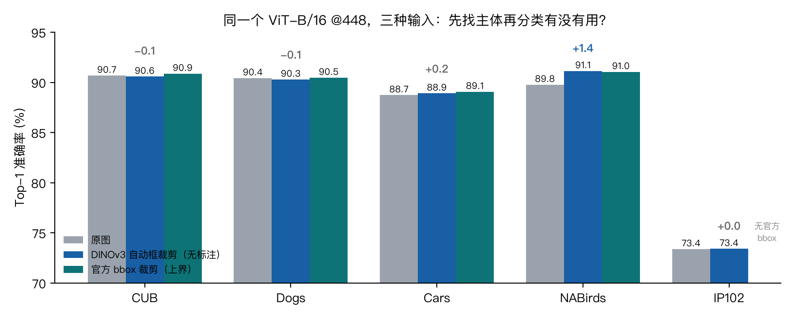
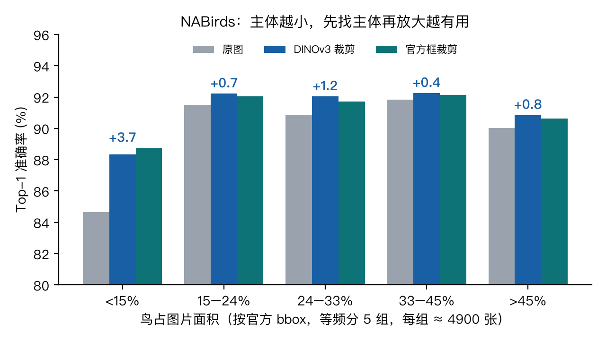
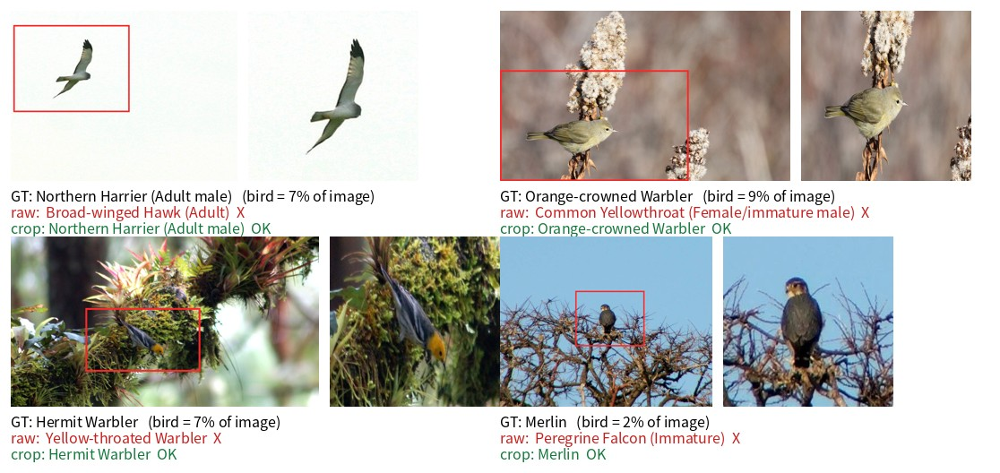
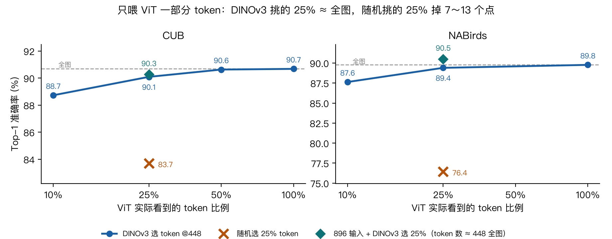

# DINOv3 找主体 → 纯 ViT 分类：一次课堂复现

> 闽江大学《深度学习》课堂汇报（2026 秋）· 开源项目轻量复现
> 对象：[facebookresearch/dinov3](https://github.com/facebookresearch/dinov3)（Meta FAIR，⭐ 11.4k，复现固定在 commit `6876159`）
> 组员：余官松 · 陈良宇 · 沈逸帆

**一句话结论**：DINOv3 不用任何标注就能把细粒度图像里的主体框到接近人工标注的水平（IoU ≈ 0.8）；这个"主体在哪"的信息有两种用法——
**主体看不清时先找再放大换精度**（NABirds +1.4，最小的 20% 图 +3.7），**主体看得清时只让 ViT 看它挑出的 1/4 token 换算力**（几乎不掉分，随机挑同样多的 token 要掉 7～13 个点）。

<p align="center"></p>

---

## 目录

1. [仓库里有什么](#1-仓库里有什么)
2. [环境](#2-环境)
3. [数据与权重准备](#3-数据与权重准备)
4. [Mac 本机：Demo 与前置实验](#4-mac-本机demo-与前置实验)
5. [主实验 A：先找主体再放大（裁剪）](#5-主实验-a先找主体再放大裁剪)
6. [主实验 B：只喂 ViT 一部分 token](#6-主实验-b只喂-vit-一部分-token)
7. [结果总表](#7-结果总表)
8. [踩过的坑与局限](#8-踩过的坑与局限)
9. [复现清单（课程 7 问）](#9-复现清单课程-7-问)
10. [致谢与第三方代码](#10-致谢与第三方代码)

---

## 1. 仓库里有什么

每个目录里都有自己的 README，说明该目录的文件和用法。

```
mju-dl-dinov3-locate/
├── locate/                    # 主实验代码（在实验室 2×3090 上跑）
│   ├── make_crops.py          #   阶段 1：冻结 DINOv3 找主体 → 框 → 裁剪，输出 ImageFolder 布局
│   ├── train_vit.py           #   阶段 2：纯 ViT-B/16 微调（原图 / DINOv3 裁剪 / 官方框裁剪 用同一份脚本）
│   ├── train_vit_tok.py       #   变体：ViT 只吃 DINOv3 挑出的 top-k 个 token
│   ├── analyze_size.py        #   按主体大小分组看准确率
│   ├── viz_boxes.py           #   抽样画框（红 = 自动，青 = 官方）
│   ├── nabirds_cases.py       #   "原图错、裁剪对" 的案例图
│   ├── dino_attn.py           #   从冻结的 DINOv3 里读 CLS→patch 注意力（找框 / 挑 token 的分数来源）
│   └── demo/                  #   现场演示：上传一张图 → 找框 → 原图 / 裁剪 / 25% token 三个 ViT 并排预测
├── experiments/               # Mac 本机：Demo + 前置实验（保持原目录布局，脚本按 experiments/ 相对路径找数据）
│   ├── app/                   #   Web Demo：三模型并排 PCA 着色 + 前景 mask
│   ├── scripts/               #   实验 01–03 脚本（PCA 可视化 / 1000 张前景 IoU / 冻结特征线性探针）
│   ├── notes/                 #   实验 01–03 笔记（含方法上踩的坑）
│   └── outputs/               #   实验产物（表、图、md；去掉了 300MB 的特征缓存）
├── third_party/vit_pytorch/   # jeonsworld/ViT-pytorch 的模型定义（MIT），改了一处 Windows 路径兼容
├── scripts/                   # 实验室 / Windows 上实际使用的排队脚本（路径写死，仅作记录）
├── results/                   # 全部 run 的 json（best、每千步曲线）、逐图预测、测试集框、训练日志、RESULTS.md 总表
├── figures/                   # 汇报用图
├── docs/                      # 汇报 PDF、项目索引（每页对应材料、时间线）
├── weights/                   # 放 ImageNet-21k ViT-B/16 权重（不入库）
└── data/                      # 放数据集与裁剪结果（不入库）
```

## 2. 环境

两套环境，按需装其一：

```bash
# 服务器（主实验；torch 1.13 / 2.x 均可，timm ≥ 1.0.20 才有 DINOv3）
conda create -n mju-dl python=3.9 -y && conda activate mju-dl
pip install torch torchvision --index-url https://download.pytorch.org/whl/cu118
pip install -r requirements.txt

# Mac（Demo + 前置实验，MPS 推理）
conda create -n dinov3 python=3.11 -y && conda activate dinov3
pip install torch torchvision
pip install -r requirements.txt
```

DINOv3 权重由 timm 自动从 Hugging Face 下载；国内先 `export HF_ENDPOINT=https://hf-mirror.com`。

## 3. 数据与权重准备

### 3.1 权重

```bash
# ImageNet-21k 预训练 ViT-B/16（Google 官方 npz，394MB），阶段 2 的分类器初始化
curl -L -o weights/imagenet21k_ViT-B_16.npz https://storage.googleapis.com/vit_models/imagenet21k/ViT-B_16.npz
```

### 3.2 数据集（不入库，按下面的目录结构放到 `data/`，或用 `DATA_ROOT` 环境变量指到别处）

| 数据集 | 目录 | 需要的文件 | 官方 bbox |
|---|---|---|---|
| CUB-200-2011 | `data/CUB_200_2011/` | `images/`, `images.txt`, `image_class_labels.txt`, `train_test_split.txt`, `bounding_boxes.txt` | 有 |
| Stanford Dogs | `data/Stanford_Dogs/` | `Images/`, `Annotation/`, `train_list.mat`, `test_list.mat` | 有 |
| Stanford Cars | `data/Stanford_Cars/` | `train/<类名>/*.jpg`, `test/<类名>/*.jpg`, `anno_train.csv`, `anno_test.csv`（`文件名,x1,y1,x2,y2,类`） | 有 |
| NABirds | `data/nabirds/` | `images/`, `images.txt`, `image_class_labels.txt`, `train_test_split.txt`, `bounding_boxes.txt`, `classes.txt` | 有 |
| IP102 | `data/IP102/classification/` | `train/<label>/`, `test/<label>/` | 无 |

Mac 前置实验额外需要 `experiments/data/CUB/CUB_200_2011/` 和 `experiments/data/CUB/segmentations/`（CUB 官方前景分割）。

## 4. Mac 本机：Demo 与前置实验

```bash
conda activate dinov3 && export HF_ENDPOINT=https://hf-mirror.com
bash experiments/app/run.sh            # → http://127.0.0.1:8000，首次会下载三个 ViT-S 权重，之后单图约 1.5 s（M1 Max）
```

（这个特征 Demo 也作为页签② 合并进了 §6.1 的演示页面，课堂上用后者即可。）Demo 里并排比较 `dinov2`（ViT-S/14, 448）、`dinov2_reg4`（+4 register）、`dinov3`（ViT-S/16, 512）：PCA 着色图（同色 = 特征相近）和自动前景 mask，可上传自己的图片。

前置实验（笔记在 `experiments/notes/`，产物在 `experiments/outputs/`）：

| 编号 | 脚本 | 结论 |
|---|---|---|
| 01 | `pca_features.py` | DINOv3 的 patch 特征把主体和背景分得比 DINOv2 干净（`figures/pca_v2_vs_v3.jpg`） |
| 02 | `bg_quant.py --n 1000` | CUB 1000 张：前景 IoU DINOv3 0.681 vs DINOv2 0.560，9 个"主体大小 × 背景复杂度"分组全部领先；DINOv2+register 平滑度更高但 IoU 略降 |
| 03 | `fgvc_bg.py extract && fgvc_bg.py probe` | 冻结特征 + 线性探针：三代都 84%；涂掉背景不涨（84 → 83）；**去掉 CLS 改 mean-pool 时涂掉背景反涨 12 点**——ViT 的 CLS 注意力本身就在定位 |

实验 03 的结论直接决定了主实验的设计：既然 ViT 自己会定位，裁剪必须是**放大**（crop + resize），而不是把背景涂掉。

## 5. 主实验 A：先找主体再放大（裁剪）

### 5.1 阶段 1：DINOv3 找框并裁剪

```bash
export HF_ENDPOINT=https://hf-mirror.com
# 可选：先在 CUB 训练集前 1000 张上对官方 bbox 校准阈值（我们得到 τ=0.07 最好，mean IoU 0.79）
python locate/make_crops.py --dataset cub --calib 1000 --taus 0.05,0.07,0.1,0.15 --margins 0,0.15
# 正式产出（最终使用的配置：正方形框 + 外扩 15%）
for ds in cub dog car nabirds ip102; do
  python locate/make_crops.py --dataset $ds --tau 0.07 --margin 0.15 --square --suffix _sq
done
```

做法：冻结的 DINOv3 ViT-B/16 看 448×448 的图，取最后一层 CLS→patch 注意力（28×28），按最大值归一化后 τ=0.07 二值化，取注意力质量最大的连通块的外接框，补成正方形再外扩 15%，映射回原图裁剪。每个数据集输出到 `data/crops/<ds>/`：

```
raw/{train,test}/<cls>/…        原图（软链接；Windows 下复制）
dinov3_sq/{train,test}/<cls>/…  DINOv3 自动框裁剪（全程无标注）
gt_sq/{train,test}/<cls>/…      官方 bbox 裁剪（上界，有 bbox 的数据集才有）
boxes_sq.csv                    每张图的自动框、官方框、IoU、原图尺寸
```

全部是 `torchvision.datasets.ImageFolder` 布局，阶段 2 直接指向。CUB 11,788 张在 3090 上约 3 分钟。

自动框与官方 bbox 的 IoU：CUB 0.796（97% ≥ 0.5）· Dogs 0.767（90%）· Cars 0.801（98%）· NABirds 0.789（96%）。抽样看：`python locate/viz_boxes.py nabirds` → `/tmp/nabirds_boxes.jpg`。

### 5.2 阶段 2：同一个 ViT-B/16，三种输入

```bash
for v in raw dinov3_sq gt_sq; do
  CUDA_VISIBLE_DEVICES=0 python locate/train_vit.py --data_root data/crops/nabirds/$v --name nabirds_$v
done
```

配方沿用 TransFG 的纯 ViT 基线：Resize 600 → RandomCrop 448 + 水平翻转，SGD lr 3e-2 momentum 0.9，warmup 500 步 + cosine，10k 步，batch 16，fp16。12GB 显卡用 `--train_batch_size 8 --grad_accum 2`。单个 run 3090 上约 1 小时（NABirds / IP102 测试集大，约 1.5 小时）。输出 `output/<name>.json`（best 与每千步曲线）和 `output/<name>_preds.npz`（最佳一轮的逐图预测）；加 `--save_ckpt` 会把最佳权重存成 `output/<name>.pt`（fp16，约 170MB），演示要用。

### 5.3 按主体大小分组

```bash
python locate/analyze_size.py nabirds data/crops/nabirds/boxes.csv output nabirds_raw nabirds_dinov3_sq nabirds_gt_sq
python locate/nabirds_cases.py            # "鸟 < 10%、原图错、裁剪对" 的案例图 → /tmp/nabirds_cases.jpg
```

<p align="center"> </p>

### 5.4 分辨率探针

把输入降到 224（像素 ÷4，鸟在模型眼里变小），裁剪的作用就出来了：

```bash
python locate/train_vit.py --data_root data/crops/cub/raw       --name cub_raw_224       --img_size 224 --eval_batch_size 128
python locate/train_vit.py --data_root data/crops/cub/dinov3_sq --name cub_dinov3_sq_224 --img_size 224 --eval_batch_size 128
```

CUB @224：原图 88.44 → DINOv3 裁剪 90.35（+1.9），接近 448 原图的 90.68。

## 6. 主实验 B：只喂 ViT 一部分 token

ViT 的注意力对 token 数量没有要求：patch embedding 之后，只把 DINOv3 注意力最高的 k 个 patch（加 CLS）送进 Transformer，其余直接删掉，模型结构不改。训练和测试同样处理，DINOv3 在线打分。

```bash
python locate/train_vit_tok.py --data_root data/crops/cub/raw --name cub_tok25  --select dinov3 --keep 0.25   # DINOv3 挑 25%
python locate/train_vit_tok.py --data_root data/crops/cub/raw --name cub_rand25 --select random --keep 0.25   # 随机挑 25%（对照）
python locate/train_vit_tok.py --data_root data/crops/cub/raw --name cub_tok25_896 --select dinov3 --keep 0.25 \
       --img_size 896 --train_batch_size 8 --grad_accum 2 --eval_batch_size 32                                 # 先放大再挑
```

<p align="center"></p>

| 保留 token | 谁选 | CUB @448 | NABirds @448 |
|---|---|---|---|
| 100% | — | 90.68 | 89.77 |
| 50% | DINOv3 | 90.63 | — |
| 25% | DINOv3 | 90.09 | 89.40 |
| 10% | DINOv3 | 88.73 | 87.63 |
| 25% | **随机** | **83.69** | **76.43** |
| 25%，输入 896 | DINOv3 | 90.27 | 90.51 |

"看得少"不掉分，"看错地方"才掉。896 + 挑 25%（token 数与 448 全图相同）在 NABirds 上 +0.7，但不如直接裁剪的 +1.4——放大的收益裁剪已经拿到，挑散点反而漏边缘和上下文，这是一个诚实的负结果。

### 6.1 现场演示

```bash
conda activate dinov3 && export HF_ENDPOINT=https://hf-mirror.com
python locate/demo/server.py        # → http://127.0.0.1:8001
```

一个页面两个页签：**① 找主体 → 分类**（DINOv3 的注意力与自动框 → 裁剪图 → 三个 NABirds 分类器的 top-5 与耗时）和 **② 三个冻结 ViT 在看什么**（§4 的特征对比 Demo 合并进来了）。右上角有"DINOv3 的注意力图是怎么来的？"的图解说明。需要 `weights/` 下三个微调权重（训练时加 `--save_ckpt` 即得，见 `locate/demo/README.md`）。M1 Max 上一张图约 0.2 秒。

## 7. 结果总表

主实验 A（Top-1 %，seed 42 / seed 1）：

| 数据集 | 原图 | DINOv3 自动框裁剪 | 官方 bbox 裁剪 |
|---|---|---|---|
| CUB | 90.68 / 90.61 | 90.58 / 90.82 | 90.87 |
| Dogs | 90.43 / 90.94 | 90.29 / 90.50 | 90.47 |
| Cars | 88.73 / 88.60 | 88.91 / 88.75 | 89.07 |
| **NABirds** | 89.77 / 89.79 | **91.14 / 91.14** | 91.05 |
| IP102 | 73.38 | 73.41 | —（无 bbox） |

NABirds 按鸟占图面积分 5 组：最小的 20%（< 15%）原图 84.66 → 裁剪 88.33（**+3.7**），其余四组 +0.4 ～ +1.2。主体本来就大的 CUB / Dogs / Cars 持平（两个 seed 都在 ±0.4 内）。

全部 35 个 run 的 best / final、逐图预测、测试集的框与 IoU、训练日志在 [`results/`](results/README.md)，不重跑就能复算上面每个数字，例如：

```bash
python locate/analyze_size.py nabirds results/lab/boxes/nabirds_test_boxes_sq.csv.gz results/lab/output nabirds_raw nabirds_dinov3_sq nabirds_gt_sq
```

## 8. 踩过的坑与局限

- **框裁得太紧反而掉分**（第一版）：紧贴主体的框在 CUB 上自动框 90.20、官方框只有 88.14，比原图还低；Dogs 同样。原因是细长框被 `Resize((600,600))` 拉变形，且丢掉了周围的环境线索。改成"补成正方形 + 外扩 15%"后两者回到 90.6 / 90.9。越紧掉越多这个顺序（官方紧框 < DINOv3 的格子框 < 原图）本身就是证据。
- **DINOv3 找框会被更显眼的东西带走**：花、路边的卡车、松鼠；NABirds 约 4% 的图 IoU < 0.5（`figures/nabirds_boxes.jpg` 右下）。
- **seed**：主要结果 2 个 seed，±0.4 以内的差异不当结论。
- **开销**：找框要多跑一个 ViT-B（448 输入约 78 GMACs，与分类器相当）；找框降到 224 只要 1/4 算力，CUB 上仍 +0.9。

## 9. 复现清单（课程 7 问）

| 问题 | 在哪回答 |
|---|---|
| ① 解决什么问题 ② 为什么值得关注 | 汇报 PDF 第 3–4 页；`experiments/notes/01` |
| ③ 核心原理 | PDF 第 5 页（ViT 切块 → DINO 学生/老师对齐 → 冻结提特征，Gram anchoring） |
| ④ 如何安装运行 | 本文 §2–§4，`experiments/app/run.sh` |
| ⑤ 实际复现结果 | §5–§7，`results/` |
| ⑥ 对应课程知识点 | ViT 结构与 patch token、自监督预训练、注意力（token 选择直接用了"注意力对 token 数无要求"） |
| ⑦ 局限与改进 | §8 |

汇报 PDF：[`docs/DINOv3-Talk-slides.pdf`](docs/DINOv3-Talk-slides.pdf)；每页对应的材料、时间线、复现命令：[`docs/PROJECT_INDEX.md`](docs/PROJECT_INDEX.md)。

## 10. 致谢与第三方代码

- [facebookresearch/dinov3](https://github.com/facebookresearch/dinov3)（DINOv3 License）——权重经 [timm](https://github.com/huggingface/pytorch-image-models) 加载
- [jeonsworld/ViT-pytorch](https://github.com/jeonsworld/ViT-pytorch)（MIT）——`third_party/vit_pytorch/`，ViT-B/16 模型定义与 npz 加载
- ImageNet-21k ViT-B/16 权重来自 [google-research/vision_transformer](https://github.com/google-research/vision_transformer)（Apache-2.0）
- 训练配方参考 [TransFG](https://github.com/TACJu/TransFG)

本仓库自己的代码（`locate/`、`experiments/`）以 MIT 协议发布，见 `LICENSE`。
